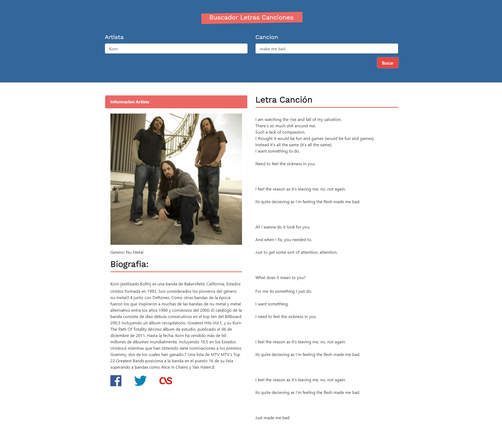

# Buscador de letras de Canciones y Artistas [ReactJs].
## con Dos APIS - con Axios

_Aplicacion que consume dos APIS, una para la busquedad de letras de canciones, [LyricsOVH](https://lyricsovh.docs.apiary.io/#reference) y otra para la informacion de los artistas [theAudioDB](https://www.theaudiodb.com/api_guide.php)_

## Demo 🎮

Este es el Demo de la aplicacion, **Update[ 01/03/2021 ]** [Click Aquí](https://dreamy-hopper-efd4c2.netlify.app)

## Importante ℹ

_si entras en cada uno de los commits podras ver como fue mi proceso paso a paso de lo que fui aprendiendo en el curso de react, y si quieres algo en especifico buscarlo en alguno de los commits del proyecto y alli lo encontraras!._

## Comenzando 🚀

_Estas instrucciones te permitirán obtener una copia del proyecto en funcionamiento en tu máquina local para propósitos de desarrollo y pruebas._

Facil primero lo clonas con este comando:

## `git clone https://github.com/alejandrobecerraptor/buscador-letras-con-dos-APIS.git`

_Despues de eso te toca descargar las dependencias con:_ ⚙️

## `npm install`

_luego tendras que arrancar el proyecto y para eso necesitas ejecutar el comando:_

## `npm start`

y listo disfruta! 🍦

## Construido con 🛠️

* [ReactJs](https://reactjs.org/) - Libreria de JavaScript
* [NPM](https://nodejs.org/es/download/) - Manejador de dependencias
* [create-react-app](https://github.com/facebook/create-react-app) - Herramienta para la creacion del proyecto.
* [LyricsOVH](https://lyricsovh.docs.apiary.io/#reference) - API que me trae la letra de las canciones.
* [theAudioDB](https://www.theaudiodb.com/api_guide.php) - API que me trae la informacion del artista.

## Autores ✒️

* **Alejandro Becerra** - *Desarrollador Inicial* - [GitHub](https://github.com/alejandrobecerraptor)
Allí Encontraras mi correo de contacto.

## Contribuyendo 📣

¿Tienes ideas para aportar a este proyecto? por favor ingresa a mi perfil  [Aquí](https://github.com/alejandrobecerraptor) y busca mi correo de contacto para detalles del proceso para enviarnos pull requests.

## ¿Quieres saber mas de ReactJs?

si quieres crear un proyecto con ReactJs te recomiendo que visites este link [Create React App](https://github.com/facebook/create-react-app).

Puedes leer mas en el siguiente link, [Create React App documentation](https://facebook.github.io/create-react-app/docs/getting-started).

y tambien por aqui ;) [React documentation](https://reactjs.org/).
